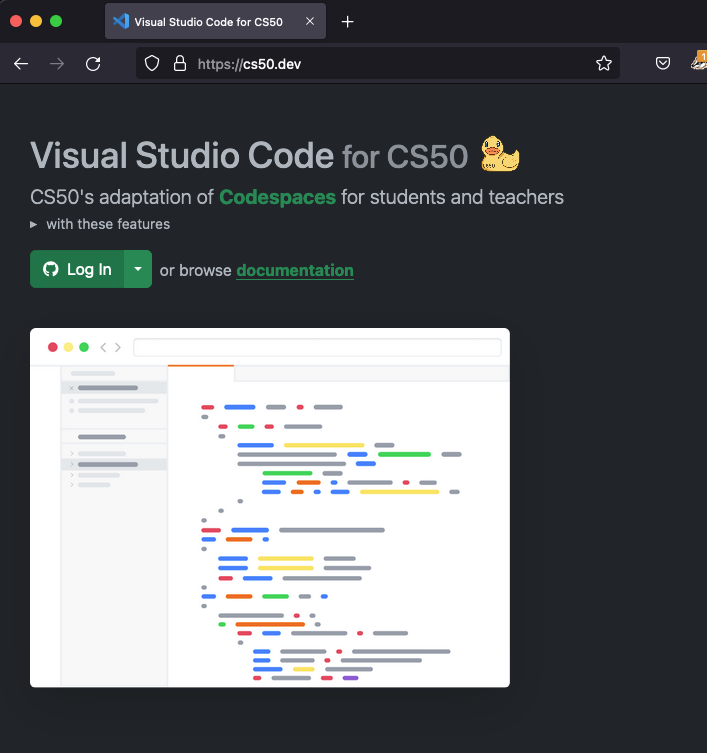
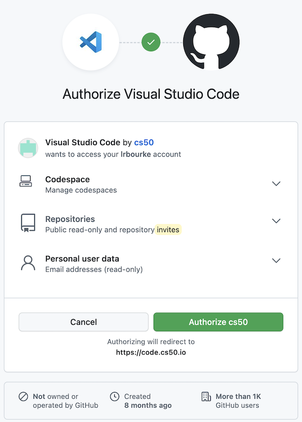
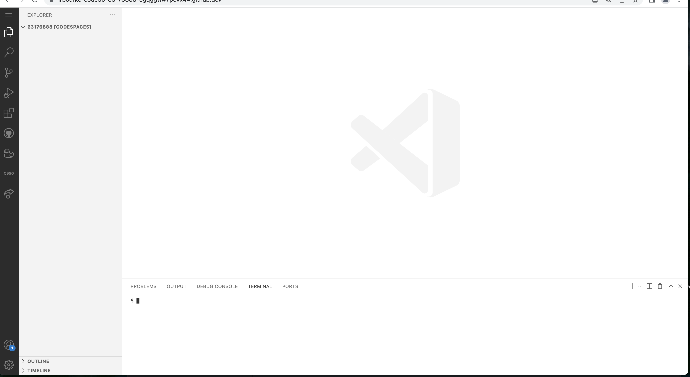
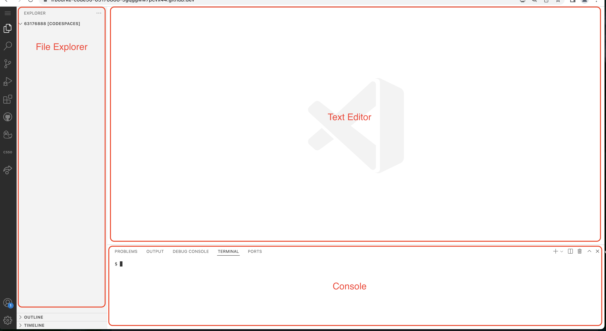
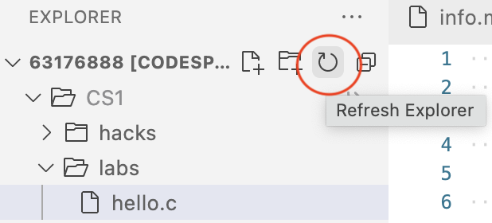

# Computer Science I
## Lab 1.0 - Introduction
[School of Computing](https://computing.unl.edu)  
[College of Engineering](https://engineering.unl.edu/)  
[University of Nebraska-Lincoln](https://unl.edu)  

This lab introduces you to your programming environment and the
software development workflow and handin/grading process used
by this course.  

## Prior to Lab

In each lab there may be pre-lab activities that you are *required* to
complete prior to attending lab. Failure to do so may mean that you are
not prepared to complete the lab.

1.  For this lab, you'll need to sign up with GitHub, a website that
    hosts *software repositories* using git (a distributed version
    control system). With GitHub you'll be able to store, manage and
    backup your source code. Git is an essential software development
    tool that you'll want to fully utilize.

    Go to <https://github.com> and sign up if you don't have an account
    already.

2.  Accept the invite that your instructor sent out from
    [codepost.io](https://codepost.io) and be sure you can sign in.
    Graders will provide line-by-line feedback on  your hacks, exams
    and other assignments using this site.

Some other department and university computing resources and policies
can be found at the following:

  -   SoC Website: <http://computing.unl.edu>

  -   UNL Computing Policy: <http://www.unl.edu/ucomm/compuse/>

  -   SoC Academic Integrity Policy:
      <http://computing.unl.edu/academic-integrity-policy>

  -   SoC System Frequently Asked Questions (FAQ):
      <http://computing.unl.edu/faq>

  -   SoC Account Management: <https://cse-apps.unl.edu/amu/>

  -   SoC Undergraduate Advising Page: <http://computing.unl.edu/advising>

  -   SoC Student Resource Center: <http://computing.unl.edu/src>

## Peer Programming Pair-Up

***For students in online section(s):*** you may complete
the lab on your own if you wish or you may team up with a partner
of your choosing, or, you may consult with a lab instructor to get
teamed up online (via Zoom).

***For students in the on campus section:*** your lab instructor
may team you up with a partner.  

To encourage collaboration and a team environment, labs are be
structured in a *peer programming* setup.  At the start of
each lab, you will be randomly paired up with another student
(conflicts such as absences will be dealt with by the lab instructor).
One of you will be designated the *driver* and the other
the *navigator*.  

The navigator will be responsible for reading the instructions and
telling the driver what to do next.  The driver will be in charge of the
keyboard and workstation.  Both driver and navigator are responsible
for suggesting fixes and solutions together.  Neither the navigator
nor the driver is "in charge."  Beyond your immediate pairing, you
are encouraged to help and interact and with other pairs in the lab.

Each week you should alternate: if you were a driver last week,
be a navigator next, etc.  Resolve any issues (you were both drivers
last week) within your pair.  Ask the lab instructor to resolve issues
only when you cannot come to a consensus.  

Because of the peer programming setup of labs, it is absolutely
essential that you complete any pre-lab activities and familiarize
yourself with the handouts prior to coming to lab.  Failure to do
so will negatively impact your ability to collaborate and work with
others which may mean that you will not be able to complete the
lab.  

## Lab Objectives & Topics

At the end of this lab you should be familiar with the following

  -   The [Visual Studio Code](https://code.cs50.io/) IDE that
      you'll use for this course

  -   Basic unix commands

  -   Cloning lab code from Github

  -   Modifying, compiling and executing your first C program

  -   Using [codepost.io](https://codepost.io) to view grader
      feedback

# Activities

## Getting Started

Let's get started. In order to develop programs in C you'll need:
 * a code editor (plain text editor) to write your code
 * a compiler to compile the C code into executable machine code, and
 * a runtime environment to actually execute your program
To do this, we'll walk you through how to use the **Visual Studio Code**
(<https://code.cs50.io/>) online IDE (Integrated Development
Environment). This is a web browser-based IDE which means you
don't have to install any software.  It is free and you login
using your GitHub account. It also offers a *persistent* environment:
files you save in the IDE will be available next time you login.

1. Point your browser to <https://ide.cs50.io/> sign in with GitHub:



***Be sure that you have enabled cookies in your browser***

2. The first time you'll be asked to authorize this site to access
   elements of your GitHub account, click Authorize cs50.



3.  Once logged in, it should looks something like the following.



4. Observe the major layout areas:



1.  File Explorer - This is a graphical file explorer in which you can
    right click and create new directories (folders) and files, drag and
    drop to move things around, etc.

2.  Text Editor - Double click on a plain text file and it will open in
    this file editor so you can edit it. This is a tabbed environment so
    multiple files can be opened at once.

3.  Console - this is a Text User Interface (TUI) console in which you
    can type and execute commands to compile and run (text-based)
    programs in a Linux (ubuntu) environment.

## Setup

Let's get started an setup our environment.  

1.  First, we need to make some directories that we'll be using for
    the rest of the semester.  Execute the following commands by
    typing each into the TUI console:
    ```bash
    mkdir /workspaces/CS1
    mkdir /workspaces/CS1/labs
    mkdir /workspaces/CS1/hacks
    mkdir /workspaces/CS1/misc
    ```

2.  Next we'll create a *symbolic link* so that these directories will
    appear in the file explorer.  Execute the following command:

    `ln -s /workspaces/CS1 CS1`

3.  Every time you start the IDE, your console will start out in a
    directory named something like `/workspaces/123456`, but we'll
    want to work in the `CS1` directory where we made our directories.
    So, let's *change directories* by executing the following command:

    `cd /workspaces/CS1`

    ***Note***: you will need to change directories every time you login
    to your IDE (this is necessary because the IDE prevents you from
    using git in the `/workspaces/123456` directory for
    ["reasons"](https://cs50.readthedocs.io/code/#using-git)).

### Basics

You can create files in your IDE either by:
  * Dragging and dropping files from your computer to the File Explorer or
  * Right clicking a folder and selecting New File

1. Create a file named `info.md` (a *markdown* file) in the `misc` directory
and open it for editing by double clicking it.  Enter your name in this
file (changes are generally automatically saved).

2.  Now we'll get familiar with the console and some basic unix
    commands. Click in the console area. To execute a command you
    type it in the console and then hit enter.

    1.  Type the command `ls` (short for "list") and hit enter.
        This lists the files and directories in the
        *current working directory*. You should see your the three
        directories we created above.

    2.  Let's change our current working directory so that we're *in*
        the `misc` directory. Type the following command
        `cd misc` (short for "change directory"). Type
        `ls` again and you'll see your the files in your `misc`
        directory (should just be the `info.md` file you created).

    3.  You can determine *where* in the directory structure you are by
        typing the command `pwd`. Try it; you'll see that your
        `misc` directory is actually under a
        `/workspaces/12345678/CS1/misc` directory

    4.  You can go back "up" the directory structure by typing the
        command `cd ..` (`..` is short hand for the
        *parent* directory or one directory up in the hierarchy)

    5.  You can also remove a file using the `rm fileName`
        command which will *permanently delete* the file. Careful, there
        is no undo or recycle bin! You can also remove a file by right
        clicking and deleting it in the File Explorer.  

A more comprehensive tutorial on unix commands is available here:
<http://www.math.utah.edu/lab/unix/unix-commands.html>.

## Editing Code

Programming requires that you write code in a *source file*, a plain
text file that contains syntactically valid programming commands. In
general, you can use any plain text editor to edit code (MS Word is not
a plain text editor). However, it is much better to use a text editor
designed for code that uses *syntax highlighting* to help you
differentiate various programming elements by highlighting them in
different colors and fonts. This IDE provides such an editor. Let's
practice writing some code.

1.  In your `misc` directory create a new file named
    `hello.c`

2.  Open the file and edit its contents to look like the following but
    with your name and the current date.

    ``` c
    /**
     * Author: Your Name
     * Date: 20xx/xx/xx
     *
     * A simple hello world program in C
     *
     */
    #include <stdlib.h>
    #include <stdio.h>

    int main(int argc, char **argv) {

      printf("Hello World!\n");

      return 0;
    }
    ```

3.  Now let's *compile* this code into an executable program. In the
    console, type the following command (be sure you're still in the
    `misc` directory):

    `gcc hello.c`

    `gcc` (GNU Compiler Collection) is a C compiler. In general
    in unix/linux if a command is successful nothing will be displayed;
    "no news is good news." If you made a mistake the compiler will give
    you a (sometimes) helpful hint about what was wrong. If you made a
    mistake fix it and repeat until it successfully compiles.

4.  When successful, the compiler produces an *executable* file named
    `a.out`. Use `ls` to verify that the new file has been
    created.  You should also observe that it has now appeared in the
    File Explorer.  If it has not, you can click the refresh icon to
    refresh the File Explorer:



5.  Run your program by typing the following command: `./a.out`
    which should print `Hello World!` to the Console.

Congratulations on your first program!

## Checking Out Code From Github

Each lab will have some starter code and other *artifacts* (data files,
scripts, etc.) that will be provided to get you started. The code is
hosted on GitHub (<https://github.com>) and you must *clone* a copy of
it to your own workspace.

1.  Change your current working directory to your `labs`
    directory. To do this you can use `cd ..` then
    `cd labs` (assuming you are currently in `misc`) or
    you can do this in one step:

    `cd ../labs`

    which means "go up one directory, then down to `labs`."

2.  To clone, use the the following command:

    `git clone https://github.com/cbourke/CSCE155-C-Lab01`

3.  A new directory, `CSCE155-C-Lab01` should be created, go into
    this directory by typing `cd CSCE155-C-Lab01`

4.  List the contents of this directory by typing `ls`. If
    everything worked, there should be a (different) `hello.c` file in your
    directory similar to the one you just wrote.

Boring. Been there done that. So, let's modify the program.

1.  Open the `hello.c` source file (you now have two files with
    that name, so be sure you're editing the correct one or close the
    other).

2.  Modify the file by changing the author to you (and your partner if
    you have one) and change the date.

3.  Add a new line below the line that prints "Hello World!" that
    prints your (and your partner's) names by using the `printf` line
    as an example.

4.  Save, compile and run your program to make sure it works.

## Submitting & Grading Your Program

Many of your assignments will include a programming portion that will
require you to hand in source files for graders to compile and evaluate.  
To do this, you will use a the CSE webhandin.

 * First, we need to get your source file to *your computer*.
   Right now, the files only exist on the IDE server.  Right click
   on the `hello.c` file and click download.  You can also download
   a copy of your entire project by right-clicking a folder
   (in fact, it is a good idea to periodically backup your project by
   downloading it, but using git is a much better solution).
 * Point a new browser tab to <https://cse-apps.unl.edu/handin>
 * Login with your CSE credentials
 * Click on this course and lab 1.0.  You can either click the
   large "handin" area and select your downloaded `hello.c`
   file or you can drag-drop the file.  You can (re)submit the same file as
   many times as you want up until the due date.  

Some things to understand about webhandin:

 * File names are case sensitive and you may only submit files
   with names as specified by the particular assignment
 * There is no need to delete the file if you need to resubmit
   it, the old version will be overwritten
 * If you make no changes to the file the resubmission will be rejected
 * The most common mistake is handing in the *wrong version*
   of a file, so be aware of which file(s) you're handing in

## Grading Your Program

Now that the file has been handed in, you can "grade" yourself
by using the webgrader.

 * Open a new tab/window and point your browser to one of
   the following depending on which course you are in:
   * CSCE 155E: https://cse.unl.edu/~cse155e/grade
   * CSCE 155H: https://cse.unl.edu/~cse155h/grade
   * ECEN 194: https://cse.unl.edu/~c-ecen194/grade
 * Login using your CSE credentials
 * Select the appropriate assignment (Lab 01), click "Grade" and
   observe the results.

Some things to understand about webgrader:

 * For future assignments and labs, you can compare the results of
   your program with the "Expected Result".  In general, the output
	 does not need to match *exactly* as long as you report *at least*
	 as much information as the expected output, you're probably good.
 * If there are problems or errors with your program(s),
   you should fix/debug them and repeat the handin/grading process.
	 You can do this as many times as you like up until the due date.  
 * Some programs and assignments will run test cases and may provide
   expected output alongside your output.  Others may have more
   sophisticated test cases and actually provide you a percentage of
   test cases passed.  It is your responsibility to read, understand
   and *address* any and all errors and/or warnings that the grader
   produces.
 * The webgrader is a **black box** tester meaning you don't have
   access to its internal workings.  You should properly and thoroughly test
   and debug your programs locally instead of relying on webgrader as a
   "blind tester."

## Codepost.io

For many assignments (hacks, project, exam) we use a web-based assessment
app called codepost.io (<https://codepost.io>).  You would have received an
invitation to this website from your instructor.  As a last step to the lab,
be sure you have accepted the invite and can login to the system.  You will
receive further instructions with your first hack.

***Congratulations on your first lab!***
